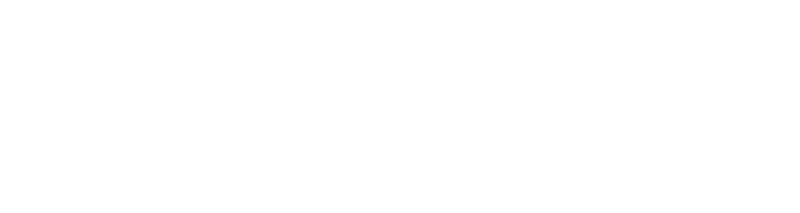

# Fire Emblem Heroes Rerun Schedule

  

An unofficial fan website by **Clustifle** for browsing Fire Emblem Heroes summoning banners, hero reruns, and revival schedules.

**Version 1.0 · First release**

**[Visit the website](https://clustifle.github.io/FEH-Rerun-Schedule-by-Clustifle/)**

## About the game

**Fire Emblem Heroes** is a mobile tactical role-playing game from Nintendo and INTELLIGENT SYSTEMS. Players summon heroes from across the Fire Emblem series and build teams for turn-based battles.

## Summoning banners

The home page displays current and upcoming banners, featured heroes, active dates, and countdowns.

- **Legendary / Mythic / Emblem:** Featured lineups arranged by weapon color.
- **New / Special Heroes:** Four featured heroes from new or seasonal summoning events.
- **New Heroes Return / Double Special Heroes:** Returning lineups with two heroes per weapon color.
- **Remix:** Two groups of eight heroes sharing one window, with a fading transition and manual selection.
- **Revivals:** New Heroes and Hall of Forms revival cards.

Banner times follow the timezone selected in Settings. Check in-game announcements for confirmed dates, lineups, and summoning details.

## Rerun schedules

| Schedule | Information |
| --- | --- |
| General | Recorded rerun months for Legendary, Mythic, Emblem, and Chosen Heroes. |
| Remix | Hero reruns associated with Remix banners. |
| L/M Revival | Monthly revival entries for older Legendary and Mythic Heroes. |
| NH Revival | Returning New Heroes lineups and Forging Bonds revivals. |
| HoF Revival | Returning Hall of Forms lineups. |
| L/M/E Waitlist | Legendary, Mythic, and Emblem Heroes awaiting a recorded rerun. |
| Double Special Heroes Waitlist | Heroes awaiting a Double Special Heroes rerun. |
| New Heroes Return Waitlist | Heroes awaiting a New Heroes Return rerun. |

The Head Administrator and Schedule Managers maintain schedules and manually add waitlist entries. A hero's schedule category does not automatically add them to a waitlist.

Recorded months are planning windows; check hero notes and official notices for confirmation. Heroes can also remain unscheduled, with notes only.

## Browsing and appearance

All Heroes offers Cards, Compact, List, and Table views, with ten sorting options. Search names, titles, hero types, and notes; combine advanced filters for hero type, weapon color and type, movement, pool, Grail visibility, schedule, blessing, and demote status. Active filter chips can be removed individually or cleared together. Use Standard or Compact views to browse schedules. Hero profiles are full pages showing rerun information, weapon and movement types, hero types, pools, and notes. Share a profile with its `/hero_profile/[hero_name]_[hero_title_name]_[hero_type]` URL; words use underscores. The L/M/E Waitlist is at `/rerun-waitlist/lme`; older waitlist links forward there. Heroic Grails units have their own icon and visibility toggle, including in Hall of Forms revivals.

Fire Emblem Heroes is the default theme, with ten realm variants available in Settings: Midgard, Nifl, Múspell, Hel, Ljósálfheimr, Dökkálfheimr, Niðavellir, Jötunheimr, Vanaheimr, and Ásgarðr.

## Credits

- **Made by:** [Clustifle](https://www.youtube.com/@Clustifle).
- **Special thanks:** [u/King41bert0713](https://www.reddit.com/user/King41bert0713/) for feature ideas and feedback.
- **Game UI and backgrounds:** [Fire Emblem Heroes Wiki game assets](https://feheroes.fandom.com/wiki/Game_assets_collection#UI_Sprite_sheets) and [combat backgrounds](https://feheroes.fandom.com/wiki/Combat_backgrounds).
- **Artwork:** © Nintendo / INTELLIGENT SYSTEMS.
- **Schedule references:** In-game announcements, official Fire Emblem Heroes notices, and community sources linked in the site's FAQ.

This is an unofficial fan project, unaffiliated with Nintendo or INTELLIGENT SYSTEMS. Third-party assets remain the property of their respective owners.

## Community and license

Everyone is welcome to contribute rerun information, corrections, ideas, testing, design, documentation, and code. Please read the [Contributing Guidelines](CONTRIBUTING.md) and [Code of Conduct](CODE_OF_CONDUCT.md).

Original project code and documentation are open source under the **[MIT License](LICENSE)**. Nintendo artwork and other third-party materials retain their respective rights and terms; see [Third-party notices](THIRD_PARTY_NOTICES.md).

## GitHub authentication

Users can continue with GitHub on the sign-in and sign-up screens. Existing users can optionally link GitHub in **Settings → Account** to keep their existing profile, favorites, and permissions. Linking is never required; email sign-in remains available. GitHub authorization requests only the email scope, with no repository access. Supabase may automatically associate verified matching email addresses under its identity-linking rules.

To activate GitHub authentication in Supabase:

1. Register a GitHub OAuth application with the website homepage and callback `https://aknsqeqykjgdyhdroqcx.supabase.co/auth/v1/callback`.
2. Enter its Client ID and Client Secret in Supabase Authentication → Sign In / Providers → GitHub, and enable the provider. Keep secrets exclusively in provider settings.
3. Enable manual identity linking in Supabase Authentication to support the optional account-link button.
4. Keep these authentication redirect URLs in the Supabase allowlist:
   - `https://clustifle.github.io/FEH-Rerun-Schedule-by-Clustifle/?auth=github`
   - `http://127.0.0.1:5184/FEH-Rerun-Schedule-by-Clustifle/?auth=github` for local testing.

This integration does not grant management privileges. Roles continue to come from the existing server-side role checks. No GitHub credentials or avatars are copied into the website repository or Supabase Storage.
